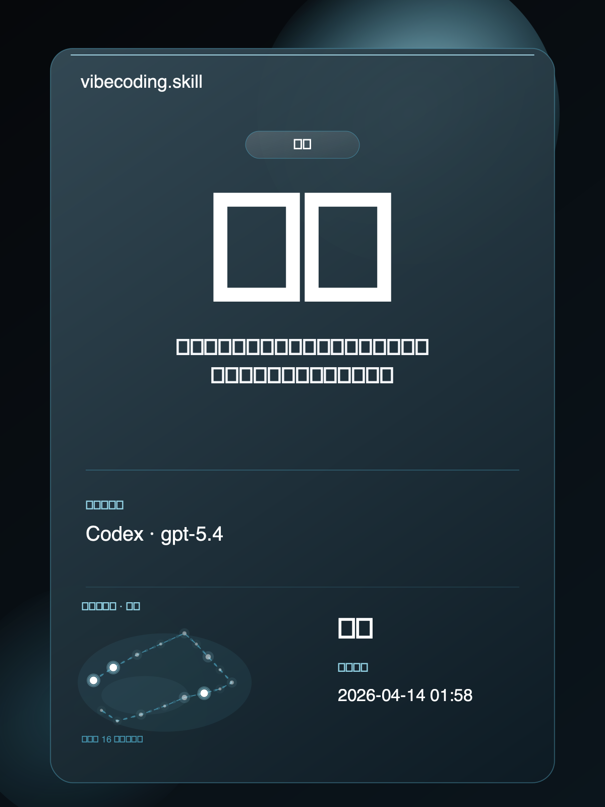

<div align="center">

# vibecoding.skill

把你和 AI 的协作方式，蒸成可复用的能力。

语言选择：
[中文](./README.md) · [English](./README_EN.md)

支持平台：
<br />
<a href="#codex"></a>
<a href="#claude-code"></a>
<a href="#opencode"></a>
<a href="#openclaw"></a>
<a href="#cursor"></a>

</div>

<table>
<tr>
<td width="52%" valign="top">

### skill 信息提取的关键字和特征（画像）

`L4` `稳定期` `目标先收束` `上下文给够` `结果可验证` `证据优先`

你和 AI 对话时，起手就像在写一条可执行的 prompt：先把目标、边界、验收和交付物钉住，再把上下文一次给够，让 code agent 一上来就知道该先读什么、先做什么。

真正开始推进后，你给 code agent 的指令偏短、偏硬、偏落地。凡是能读文件、跑命令、查日志的地方，都会先让 agent 动手，再根据结果补 prompt，不喜欢把对话拖进大段空讲。

整体看，你已经很会驱动 AI 干活，强在先收束任务、上下文给得足、对结果有验收；下一步最该补的是偏了之后的修正速度，以及更长链路里的连续推进能力。

</td>
<td width="48%" valign="top">

### 宣传卡


</td>
</tr>
</table>

## 一、能做什么

- 读日志。
- 分 16 个维度提取 vibecoding 能力：
  目标 framing、上下文供给、约束治理、沟通压缩度、执行默认、任务拆解、工具编排、上下文承接、迭代修正、失败恢复、验证闭环、产物落地、交接与记忆、抽象复用、自主推进深度、并行与工作流化。
- 判断等级和阶段，生成专属的 vibecoding 能力画像。
- 导出能力共享包，把你的协作风格打包成可分享、可展示、可直接接入的新能力。
- 读取并使用他人分享的能力，让 AI 快速进入对方的工作节奏，直接按那套打法一起推进任务。
- 给出升级建议。

## 二、如何安装

### Codex

```bash
npx skills add https://github.com/dangoZhang/vibecoding.skill -a codex
```

### Claude Code

```bash
npx skills add https://github.com/dangoZhang/vibecoding.skill -a claude-code
```

### OpenCode

```bash
npx skills add https://github.com/dangoZhang/vibecoding.skill -a opencode
```

### OpenClaw

```bash
npx skills add https://github.com/dangoZhang/vibecoding.skill -a openclaw
```

### Cursor

```bash
mkdir -p .cursor/rules
curl -fsSL https://raw.githubusercontent.com/dangoZhang/vibecoding.skill/main/.cursor/rules/vibecoding-skill.mdc -o .cursor/rules/vibecoding-skill.mdc
```

### 环境配置

- Python：`3.10+`
- 安装项目与依赖：

```bash
python3 -m pip install -e .
```

- 日志分析、等级判断、画像、报告、JSON、导出包：`macOS / Linux / Windows`
- SVG 宣传卡：`macOS / Linux / Windows`
- PNG 宣传卡：优先使用 `rsvg-convert`；未提供该命令时回退到 Python 包 `cairosvg`
- 字体效果：安装 `SF Pro` 时最接近宣传稿；未安装时回退到 `PingFang SC / Helvetica Neue / Arial / sans-serif`
- 环境自检：

```bash
python3 -m vibecoding_skill.cli doctor
```

## 三、示例 prompt 和回答

下面 6 组示例展示典型使用方式。

### 1. 蒸馏画像

Prompt

```text
帮我看下我最近两周的 vibecoding 等级，再总结一下协作习惯。
```

实机回答

> 这段记录的 vibecoding 等级是 `L4`，阶段在 `稳定期`。按这份样本看，你已经能把常见任务稳定推进到多步完成，AI 也开始承担明确的执行位。
>
> 协作习惯很清楚：
> - 起手强。你会先把目标、约束、交付物一次性交代清楚。
> - 推进快。AI 这边接到信息后会直接动手，整体节奏偏“先执行，再汇报”。
> - 偏结果导向。你提的都是可落地输出物，没有停在泛讨论。
> - 纠偏还不够强，所以“迭代修正”和“补救适配”是当前短板。

### 2. 共享能力

Prompt

```text
把我最近两周的协作方式导出来，给我共享包和接收方该怎么用的一句话。
```

实机回答

> - 共享包：`examples/generated/demo_codex_session-share-bundle`
> - 结果 skill 调用名：`vibecoding-profile-f11a0caa`
> - 结果 skill 标题：`码奸.skill`
> - 接收方下一句：`这是同事的导出包。先读他的画像，再调用 vibecoding-profile-f11a0caa 和我一起做当前任务。`

### 3. 解压应用能力

Prompt

```text
这是同事的导出包。先读他的画像，再按这套方式和我一起做当前任务。
```

实机回答

> 我会先用 `vibecoding.skill` 做入口，再接管导出包里的结果 skill。
>
> 先读这 4 个文件，顺序固定：
> 1. `PROFILE.md`
> 2. `REPORT.md`
> 3. `DISTILLED_SKILL.json`
> 4. `SKILL.md`
>
> 识别到的结果 skill 调用名是 `vibecoding-profile-f11a0caa`，显示标题是 `码奸.skill`。后续协作默认按它执行：先收束目标、边界、验收，再直接动手；优先读文件、跑命令、落产物，不先堆方案。

### 4. 利用 skill 修改 code 工作中的 prompt

Prompt

```text
调用 `vibecoding-profile-f11a0caa`，把我现在这条 code 工作里的 prompt 改成更适合这套协作方式的一版。
```

实机回答

> 我会先按 `vibecoding.skill` 读取并调用 `vibecoding-profile-f11a0caa`，再把你这条 code 工作 prompt 改成更贴合这套协作方式的一版。
>
> 改写结果如下：

```text
按 `vibecoding.skill` 先读取并调用导出的 `vibecoding-profile-f11a0caa`，再按这套协作方式帮我修这个仓库里的 bug。先用两句话收束这次任务的目标、边界和验收标准，然后直接开始做：先读相关文件、跑必要命令、查日志，定位根因并完成修复，不要先讲大段方案。如果信息不够，先补文件、日志或命令结果，不要硬猜；如果发现偏差，只补一条最关键修正后继续推进。最后只按这三项回报：改了什么、怎么验证、还有什么没验证或仍有风险。
```

### 5. 升级建议

Prompt

```text
如果我想把这套协作方式继续打磨，下一轮先练什么？
```

实机回答

> 下一轮先练 `迭代修正力`。
>
> 具体就练这一套：
> 1. 每轮结果出来先问：`偏差最大的一点是什么？`
> 2. 只补 `一条` 最关键修正，别一次加很多要求。
> 3. 如果卡住，直接让 AI 给 `3 个缩范围方案`，只选最短路径继续。

### 6. 修仙彩蛋

Prompt

```text
给我一张修仙境界风格的 vibecoding 彩蛋卡。
```

实机回答

> 检测到关键字“修仙 / 境界”，卡片已切到修仙模式。
> 这次的主卡字段会换成 `境界 / 宗门和法宝 / 出关时间`，其中 `L4` 会显示成 `金丹`。

<table>
<tr>
<td width="58%" valign="top">

实测彩蛋卡会把主字段切到修仙叙事，但底层仍然对应同一份能力判断和 16 维得分。

- `等级` 切成 `境界`
- `常用平台和模型` 切成 `宗门和法宝`
- `时间` 切成 `出关时间`

</td>
<td width="42%" valign="top">



</td>
</tr>
</table>

## 四、等级表

<table>
<tr>
<th>等级</th>
<th>典型状态</th>
</tr>
<tr>
<td><code>L1</code></td>
<td>还停在随手问答，缺少稳定方法。</td>
</tr>
<tr>
<td><code>L2</code></td>
<td>知道提问方式会影响结果。</td>
</tr>
<tr>
<td><code>L3</code></td>
<td>能稳定完成简单任务。</td>
</tr>
<tr>
<td><code>L4</code></td>
<td>常见任务可以稳定推进到多步完成。</td>
</tr>
<tr>
<td><code>L5</code></td>
<td>开始把顺手打法沉成 skill、模板或模块。</td>
</tr>
<tr>
<td><code>L6</code></td>
<td>已经有能替自己先干一段活的分身。</td>
</tr>
<tr>
<td><code>L7</code></td>
<td>能调多 agent、多工具协同完成任务。</td>
</tr>
<tr>
<td><code>L8</code></td>
<td>开始做能力层和长期工作流设计。</td>
</tr>
<tr>
<td><code>L9</code></td>
<td>人负责判断和担责，agent 负责执行和回流。</td>
</tr>
<tr>
<td><code>L10</code></td>
<td>能把自己的方法稳定复制给团队或客户。</td>
</tr>
</table>

## 五、开源证书和项目结构树图

- [MIT License](./LICENSE)

项目结构：

```text
portrait.skill
├── .cursor
│   └── rules                              # Cursor 原生规则入口
│       └── vibecoding-skill.mdc           # 主规则文件
├── README.md                              # 中文发布页
├── README_EN.md                           # 英文发布页
├── SKILL.md                               # skill 入口说明
├── LICENSE                                # 开源证书
├── pyproject.toml                         # 包配置与依赖
├── assets
│   └── readme                             # README 展示图资源
│       ├── vibecoding-card.png
│       ├── vibecoding-card.svg
│       ├── vibecoding-card-xianxia.png
│       └── vibecoding-card-xianxia.svg
├── docs
│   ├── latest-agent-terms.json
│   ├── latest-agent-terms.md
│   └── latest-agent-terms.prompt.md
├── examples
│   ├── demo_codex_session.jsonl           # Codex 示例日志
│   └── generated                          # 示例生成结果
│       ├── demo-coach.md
│       ├── demo_codex_session-share-bundle # 导出的可分享能力包
│       │   ├── DISTILLED_SKILL.json
│       │   ├── PROFILE.md
│       │   ├── README.md
│       │   ├── REPORT.md
│       │   ├── SKILL.md
│       │   ├── assets                     # 分享卡资源
│       │   └── snapshot.json              # 完整分析快照
│       ├── demo_codex_session-xianxia-card # 修仙风格卡片示例
│       │   ├── report.json
│       │   ├── report.md
│       │   ├── vibecoding-card-xianxia.png
│       │   └── vibecoding-card-xianxia.svg
│       ├── demo-distilled.json
│       ├── demo-distilled.md
│       └── demo-report.md
├── tests                                  # 单测与 CLI 端到端测试
│   ├── test_cli_e2e.py
│   └── test_secondary_skill.py
└── vibecoding_skill                       # 核心实现
    ├── __init__.py
    ├── analyzer.py
    ├── cards.py
    ├── cli.py
    ├── distill.py
    ├── exporter.py
    ├── insights.py
    ├── luogu_palette.py
    ├── memory.py
    ├── models.py
    ├── parsers.py
    ├── renderer.py
    ├── secondary_skill.py
    ├── terms.py
    ├── themes.py
    └── xianxia.py
```
