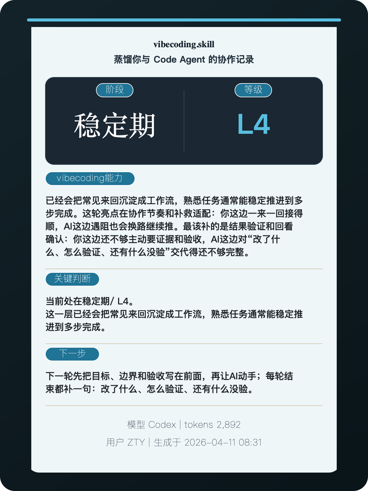

<div align="center">

# vibecoding.skill

> *"看清你与 Code Agent 的协作方式，也看见下一步怎么更强。"*

[](LICENSE)
[](https://developers.openai.com/codex/skills)
[](https://claude.ai/code)
[](https://opencode.ai)
[](https://github.com/openclaw/openclaw)
[](https://github.com/dangoZhang/vibecoding.skill/archive/refs/heads/main.zip)

<br>



<br>

把你和 Code Agent 的真实协作记录，蒸馏成一份报告、一张分享卡、和下一轮可直接照做的突破建议。<br>
默认先说人话；你明确想看“境界感”时，再切到修仙彩蛋。<br>

[](#)
[](#)
[](#)
[](#)
[](#)
[](#)

</div>

---

## 项目介绍

`vibecoding.skill` 关心的是，你有没有把 AI 真正带进工作流。

它会从真实协作轨迹里判断你当前的 `阶段`、`等级`、`最强项`、`最短板` 和 `下一步突破方向`。  
默认输出是正常的 AI / Agent 语言，适合复盘、晒图和继续训练自己的协作方式。

修仙只保留为彩蛋：

- 你主动说想看“境界”
- 你主动说想生成修仙版分享卡

---

## 安装

```bash
npx skills add https://github.com/dangoZhang/vibecoding.skill -a codex -a claude-code -a cursor -a opencode -a openclaw
```

装好之后，直接对 Agent 说下面这些话就可以。

---

## 使用

### 问境界

```text
给我一份最近 14 天的 vibecoding 报告。直接告诉我现在在什么阶段、L几、最明显的长板和短板。
```

### 生成分享卡

```text
把我最近一周和 Code Agent 的协作蒸馏成一张分享卡。大字只保留阶段和等级，正文压成一眼能看懂的摘要。
```

### 指导突破

```text
结合我最近这轮真实轨迹，告诉我最该补的一个习惯，再给我下一轮可以直接照做的突破建议。
```

### 彩蛋模式

```text
如果有彩蛋版，也顺手把这份结果翻成修仙风格分享卡。
```

---

## 境界与等级

| 综合分段 | 境界 | 等级 | 这一层的人，不一样在哪 |
| --- | --- | --- | --- |
| 0-11 | 凡人 | L1 | 还停留在单轮提问，AI 更像临时工具 |
| 12-23 | 感气 | L2 | 已知道问法会改变结果，但稳定性还不够 |
| 24-35 | 炼气 | L3 | 能做成小任务，也会边做边补要求 |
| 36-47 | 筑基 | L4 | 常见任务能稳定推进到多步完成 |
| 48-59 | 金丹 | L5 | 开始把重复打法沉淀成可复用套路 |
| 60-69 | 元婴 | L6 | 会让 AI 先走一段，再回来收方向和结果 |
| 70-77 | 化神 | L7 | 能同时调动多 Agent 和工具并行推进 |
| 78-85 | 炼虚 | L8 | 开始搭能力、搭流程，不只是在做单次任务 |
| 86-91 | 合体 | L9 | 能把这套协作带进真实项目并持续修正 |
| 92-100 | 大乘 | L10 | 能把方法沉淀下来，稳定复制给团队 |

---

## 词汇表

- [vibecoding / AI / 修仙彩蛋词汇表](./docs/lexicon.md)

---

<div align="center">

MIT License © [dangoZhang](https://github.com/dangoZhang)

</div>
